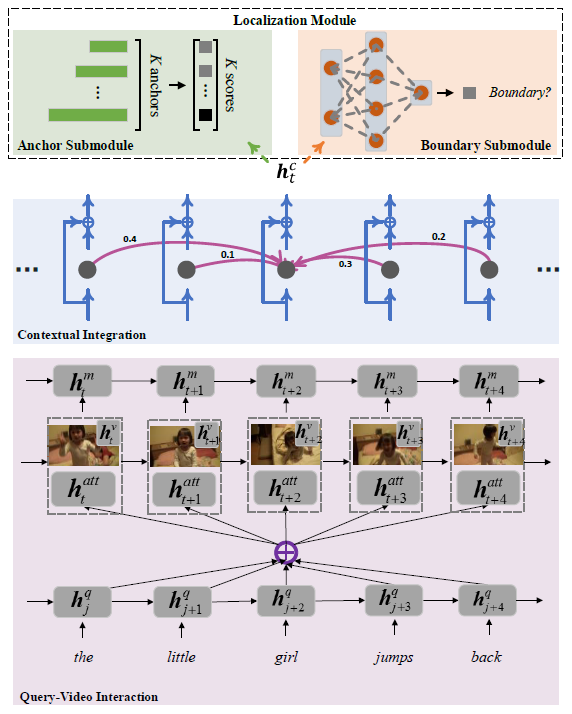

# CBP
Official Tensorflow Implementation of the AAAI-2020 paper [Temporally Grounding Language Queries in Videos by Contextual Boundary-aware Prediction](https://arxiv.org/abs/1909.05010) by Jingwen Wang *et al.*



### Citation

    @inproceedings{wang2020temporally,
      title={Temporally Grounding Language Queries in Videos by Contextual Boundary-aware Prediction},
      author={Wang, Jingwen and Ma, Lin and Jiang, Wenhao},
      booktitle={AAAI},
      year={2020}
    }

### Requirements
``` bash
pip install -r requirements.txt
```

### Data Preparation
1. Download Glove word embedding data.
``` shell
cd download/
sh download_glove.sh
```

2. Download dataset features.

TACoS: [BaiduDrive](https://pan.baidu.com/s/1OfaQW9622iGor-qXDWbwLA), [GoogleDrive](https://drive.google.com/file/d/13JLnFhSzi8MPRzOG2Ao_q-J5-T5tewcg/view?usp=sharing)

Charades-STA: [BaiduDrive](https://pan.baidu.com/s/1ODW4JIXfCCIbozPcaD_-UA), [GoogleDrive](https://drive.google.com/file/d/1Df2MUL0o0kpxD1IvCCtpazukt4fdMX0a/view?usp=sharing)

ActivityNet-Captions: [BaiduDrive](https://pan.baidu.com/s/1W9S7_nHf3nzDm1TDjm0YBA), [GoogleDrive](https://drive.google.com/file/d/1pkIDiKzzLJwgzkDFumIeOrssLxJhSmox/view?usp=sharing)

Put the feature hdf5 file in the corresponding directory `./datasets/{DATASET}/features/`

We decode TACoS/Charades videos using `fps=16` and extract C3D (fc6) features for each non-overlap 16-frame snippet. Therefore, each feature corresponds to 1-second snippet. For ActivityNet, each feature corresponds to 2-second snippet. To extract C3D fc6 features, I mainly refer to this [code](https://github.com/yyuanad/Pytorch_C3D_Feature_Extractor).

3. Download trained models.

Download and put the checkpoints in corresponding `./checkpoints/{DATASET}/` .

[BaiduDrive](https://pan.baidu.com/s/1Xr9u5WNq_7KlUHiwC9Lbyw), [GoogleDrive](https://drive.google.com/drive/folders/1TBXGyg1slYbX1JaBD3nfG1zkXzUZlWCH?usp=sharing)


4. Data Preprocessing (Optional)
``` shell
cd datasets/tacos/
sh prepare_data.sh
```
Then copy the generated data in `./data/save/` .

Use correspondig scripts for preparing data for other datasets.

You may skip this procedure as the prepared data is already saved in `./datasets/{DATASET}/data/save/` .

### Testing and Evaluation

``` shell
sh scripts/test_tacos.sh
sh scripts/eval_tacos.sh
```
Use corresponding scripts for testing or evaluating for other datasets.

The predicted results are also provided in `./results/{DATASET}/` .

| CBP              | R@1,IoU=0.7 | R@1,IoU=0.5 | R@5,IoU=0.7 | R@5,IoU=0.5 |    mIoU     |
| :--------------- |     :-:     |     :-:     |     :-:     |     :-:     |     :-:     |
| TACoS            |   18.54     |    23.19    |    24.88    |     35.83   |    20.46    |
| Charades         |   19.11     |    36.56    |    50.24    |     70.99   |    35.85    |
| ActivityNet      |   18.74     |    36.83    |    49.84    |     67.78   |    37.98    |

### Training

``` shell
sh scripts/train_tacos.sh
```
Use corresponding scripts for training for other datasets.
